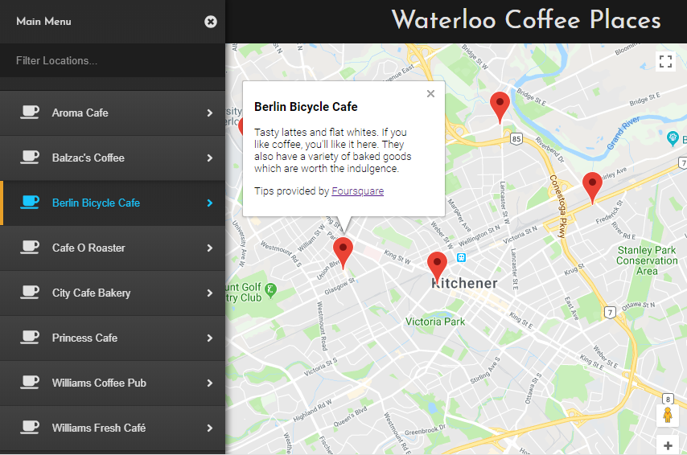

# Neighbourhood Map React

This single page app uses the Google maps API and the location-based service Foursquare API to list some coffee Locations in the Waterloo, Ontario. The project was built for the Udacity Front End Nanodegree Program. The purpose of the project is to demonstrate a good understanding of: reactJS, javascript, API usage, HTML, CSS, responsive design, and front-end web development overall.

## Preview

You can check the live website [Here](https://github.com/MsMatki/React-Neighbourhood-map)

## Screenshot

## How run on your local machine

* To run this file, download the GitHub zip file or clone the repository.
* Open the root folder of the repository in a terminal
* Get started by intalling npm, please follow this tutorial - http://blog.npmjs.org/post/85484771375/how-to-install-npm
* install all project dependencies with `npm install`
* start the development server with `npm start`

## Create React App

This project was bootstrapped with [Create React App](https://github.com/facebookincubator/create-react-app). You can find more information on how to perform common tasks [here](https://github.com/facebookincubator/create-react-app/blob/master/packages/react-scripts/template/README.md).

## How to run the project in Production Mode

* Build the production ready optimised code. npm run build
* Deploy it to gh-pages branch by npm run deploy
* NOTE: The service workers for this app will only cache the site when it is in production mode.

## Copyright and License

Copyright 2018 By Bartol. Code released under the [MIT](https://github.com/MsMatki/My-neighbourhood-React/blob/master/LICENSE) license.

## Technologies Used

* HTML5
* CSS3
* JavaScript ES6
* React.js
* jQuery
* Foursquare
* Google Maps